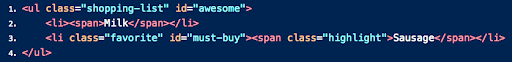
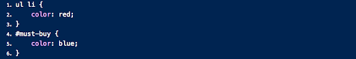

## Question A:

What color would you expect the item Sweet Halwa to show as and why?

## Question B:

What color would you expect the item "Sausage" to show as and why?

   

    

Hint: You need to view these images.  To view them use one of the following techniques. These questions test your understanding of which of the competing CSS directives are used by the browser (cascading rules). You may read about these rules if you need a refresher.

- click on the preview button within VSCode (second icon from top right in VSCode; if you don't locate it, no sweat).
- view this question within github.com in the reviews repository shared with you.

### Answers:

A.  Sweet Halwa  text is blue, because it is the first highlighted element with the class highlight inside of the ul list with teh class of shopping list therefore it is odd applying the blue color

B.Sausage has a blue text color because the id selector in css is more specific therefor it will over ride the red color of the ul li elements